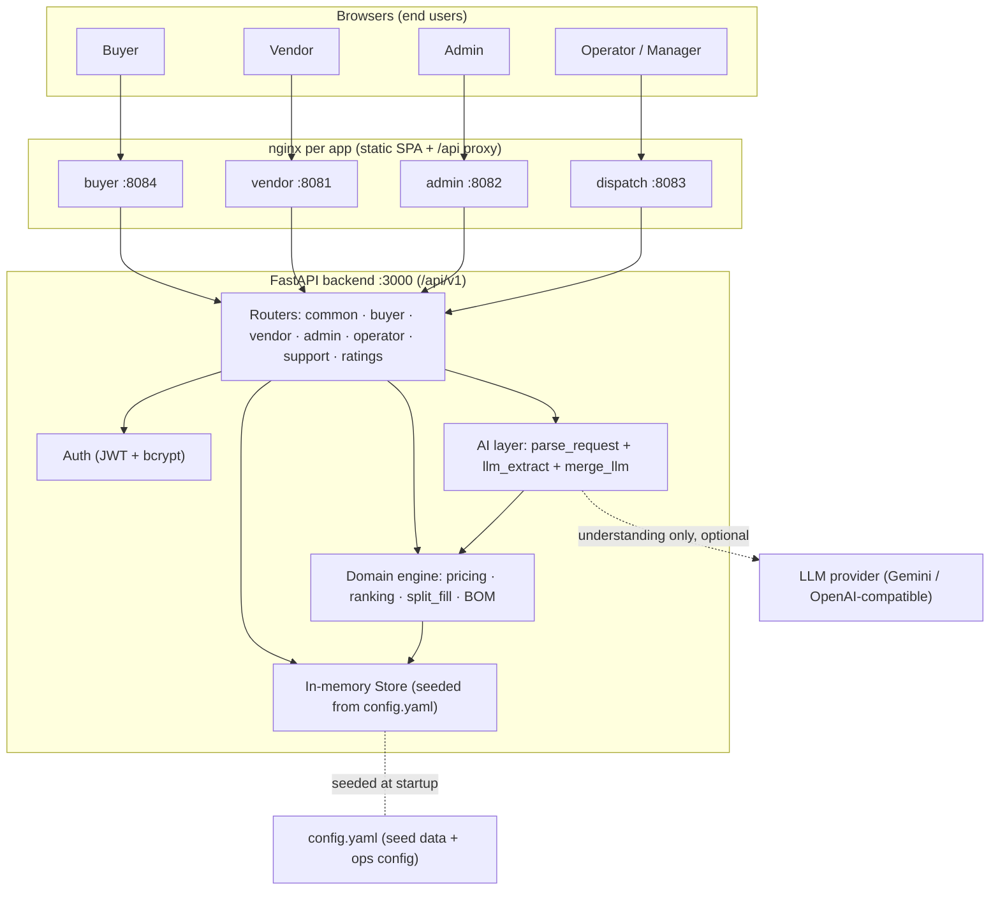
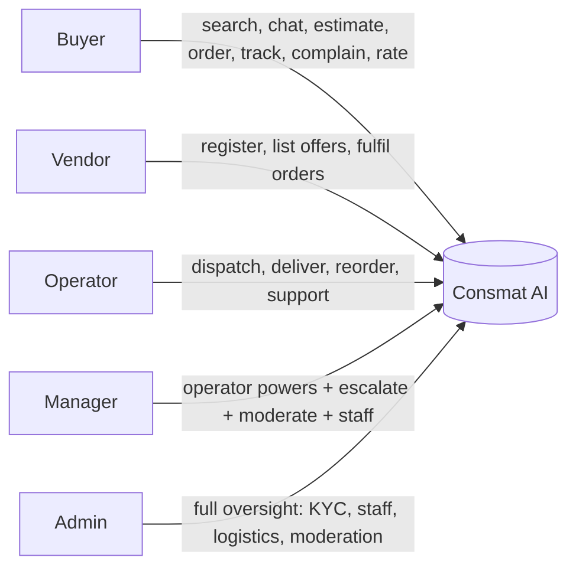
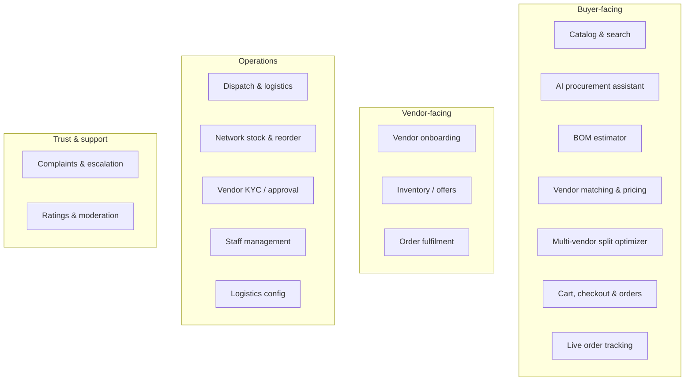
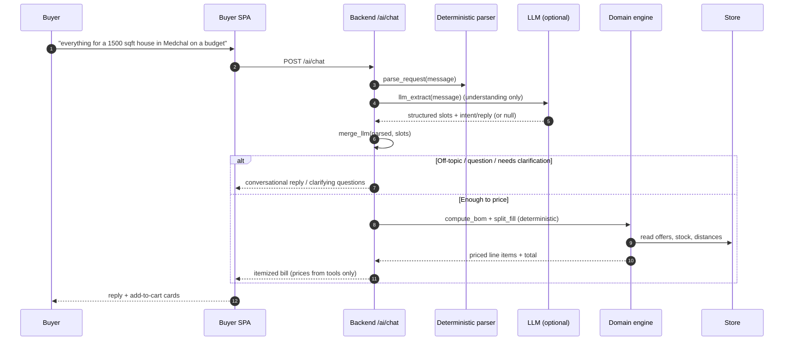
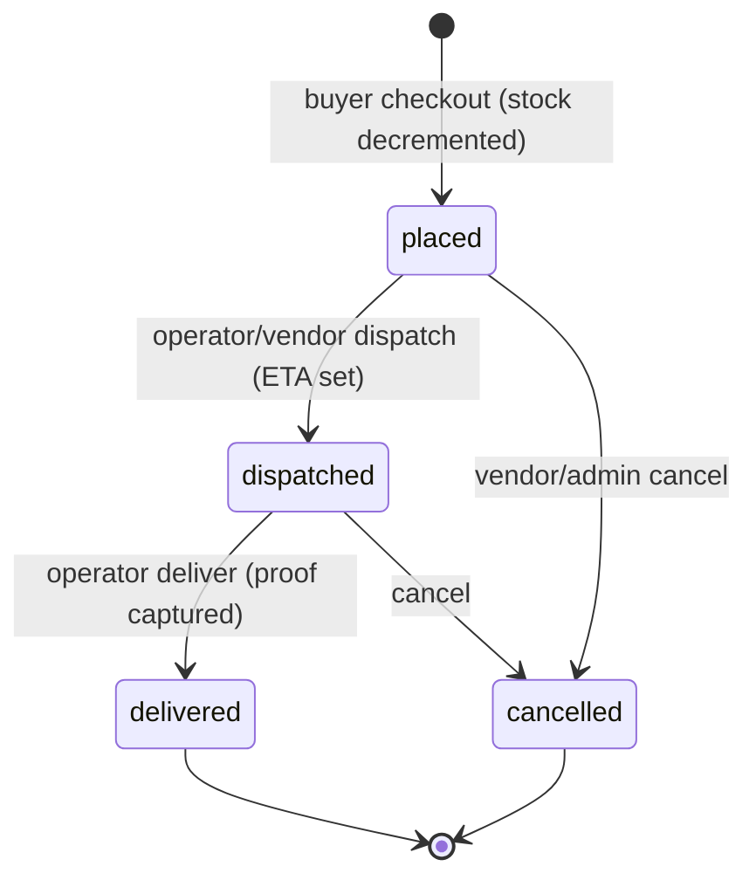
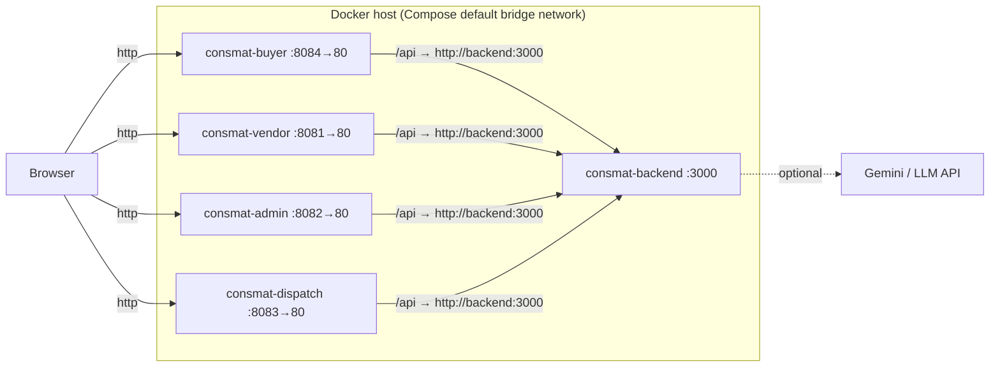

# Consmat AI — High-Level Design (HLD)

> **Document status:** Baseline · **Version:** 1.0 · **Applies to backend API:** `v1` (`/api/v1`)

---

## 1. Introduction

### 1.1 Purpose
This document describes the high-level architecture of **Consmat AI**, a B2B construction-materials
marketplace. It defines the system's building blocks, how they interact, the technology stack, the
actors it serves, and the major functional modules and data flows. It is the entry point for the more
detailed [Low-Level Design](./LLD.md) and [System-Level Design](./SLD.md).

### 1.2 Scope
Consmat AI enables buyers to discover, compare, estimate, and purchase construction materials from
multiple vendors, with an AI procurement assistant, automatic bill-of-materials estimation,
stock-aware multi-vendor order splitting, dispatch/logistics tracking, vendor onboarding/KYC,
complaints with role-based escalation, and ratings with moderation.

### 1.3 Definitions
| Term | Meaning |
|------|---------|
| **BOM** | Bill of Materials — quantities of each material required for a given built-up area |
| **Offer** | A vendor's sellable listing of a material (price, stock, optional brand) |
| **Landed price** | Material cost + logistics cost for a delivery to the buyer's location |
| **Split fill** | Allocating a required quantity across multiple vendors, cheapest-first, respecting stock |
| **PQ (price–quality)** | A 0–100 slider that biases ranking between lowest price and highest vendor quality |
| **Stub mode** | AI assistant running purely on the deterministic regex parser (no LLM/API key) |

---

## 2. System Overview

Consmat AI is a **single backend, multiple frontends** system. One FastAPI service exposes a unified
`/api/v1` API consumed by four role-specific React single-page applications:

- **Buyer app** — search/shop, AI chat assistant, BOM estimator, cart/checkout, order tracking, complaints, ratings.
- **Vendor app** — self-registration, profile, inventory (offer) CRUD, incoming orders, sales analytics.
- **Admin app** — ops metrics, vendor KYC approval, order oversight, staff management, logistics config, ratings moderation.
- **Operator/Dispatch app** — dispatch queue, live fleet tracking, network stock & reorder, customer support desk, (manager+) ratings moderation.

All application state is held in an **in-memory store** seeded at startup from `backend/config.yaml`.
This makes the system self-contained and demo-ready with no external database, while leaving a
documented path to Postgres persistence.

---

## 3. Architecture Principles & Key Decisions

1. **Deterministic pricing.** All money, stock, vendor allocation, and BOM math is computed by pure
   backend functions. The LLM only understands language — it never sets a price. See
   [LLD §6](./LLD.md#6-domain-algorithms) and [§8](./LLD.md#8-pricing-determinism).
2. **Config-driven.** Catalog, vendors, offers, pricing coefficients, logistics rates, seed users and
   orders all live in `config.yaml`. Code holds logic only.
3. **Graceful degradation.** If the LLM is disabled, over quota, errors, or times out, the assistant
   silently falls back to the deterministic parser — never a hard failure.
4. **Pluggable AI provider.** A single base-URL abstraction supports OpenAI-compatible providers
   (OpenAI, Gemini, Groq, OpenRouter, local Ollama) plus Anthropic, switchable via environment variables.
5. **One persona per app.** Each React app embodies a role; the backend enforces role guards on every
   privileged endpoint.
6. **Same-origin frontends.** Each app's nginx serves static assets and reverse-proxies `/api` to the
   shared backend, so browsers need no cross-origin configuration.

---

## 4. High-Level Architecture

**Reading the diagram:** the AI layer may call an external LLM for *understanding only* (dashed line).
Pricing always flows `Router → Domain engine → Store`, never through the LLM.

---

## 5. Component Overview

| Component | Responsibility | Technology |
|-----------|----------------|------------|
| **FastAPI backend** | Unified `/api/v1` API, business logic, auth, seeding | Python 3.11, FastAPI, Uvicorn |
| **Domain engine** (`domain.py`) | Pure math: distance, logistics, ranking, cheapest, split-fill, BOM | Python (no I/O) |
| **AI layer** (`buyer.py`) | Deterministic parser + optional LLM understanding + reply generation | Python, `urllib` → LLM HTTP |
| **In-memory store** (`store.py`) | Entities (materials, vendors, offers, users, orders, complaints, ratings) | Python dict/list + `RLock` |
| **Buyer SPA** | Shop / Chat / Estimate, cart, checkout, tracking | React 19, CRACO, Tailwind, shadcn/ui |
| **Vendor SPA** | Register, profile, inventory CRUD, orders, analytics | React 19 + React Query |
| **Admin SPA** | Metrics, KYC, orders, staff, logistics, moderation | React 19 + React Query |
| **Operator SPA** | Dispatch, fleet, stock/reorder, support, moderation | React 19 + phosphor-icons |
| **Per-app nginx** | Serve static SPA + reverse-proxy `/api` to backend | nginx 1.27-alpine |

---

## 6. Technology Stack

| Layer | Choice |
|-------|--------|
| Backend framework | FastAPI 0.115, Uvicorn (standard) 0.32 |
| Language / runtime | Python 3.11 (slim) |
| Validation | Pydantic 2.10 |
| Config | PyYAML 6.0 (`config.yaml`) |
| Auth | PyJWT 2.10 (HS256), bcrypt 4.2 |
| LLM transport | Python stdlib `urllib` (no heavy SDK dependency) |
| Frontend framework | React 19, Create React App via CRACO (`react-scripts` 5) |
| Routing | react-router-dom 7 |
| Styling / UI | Tailwind CSS 3.4, shadcn/ui on Radix primitives |
| Server state | @tanstack/react-query 5 (admin & vendor), SWR, React Context |
| HTTP client | axios 1.18 |
| Charts / toasts / icons | recharts 3, sonner 2, lucide-react (+ phosphor in dispatch) |
| Packaging | Docker (multi-stage), Docker Compose, nginx 1.27 |

---

## 7. Actors & Roles

| Role | Primary app | Capabilities |
|------|-------------|--------------|
| **buyer** | Buyer :8084 | Browse catalog, AI chat, BOM estimate, cart/checkout, track orders, raise complaints, rate |
| **vendor** | Vendor :8081 | Self-register (KYC pending), manage offers/stock, view & progress own orders |
| **operator** | Dispatch :8083 | Dispatch queue, mark dispatched/delivered, network stock & reorder, support desk |
| **manager** | Dispatch/Admin | Operator powers **plus** complaint escalation target, ratings moderation, add/remove operators |
| **admin** | Admin :8082 | Full oversight: vendor KYC approve/reject/revoke, staff, logistics config, all moderation |

---

## 8. Major Functional Modules

- **Catalog & search** — five materials with grade, unit, image, and aggregate rating.
- **AI procurement assistant** — understands free-text requests, asks clarifying questions, and prices results deterministically.
- **BOM estimator** — converts built-up area + floors + construction type into per-material quantities.
- **Vendor matching & pricing** — ranks approved, in-quality vendors by a price–quality value score with landed cost.
- **Multi-vendor split optimizer** — fills a required quantity cheapest-first across vendors respecting stock; compares split vs single-vendor.
- **Cart, checkout & orders** — places orders (honoring chosen vendor/brand/transport), decrements stock.
- **Live order tracking** — synthetic route/vehicle progress with ETA.
- **Vendor onboarding & inventory** — self-registration (pending KYC), offer CRUD with brand-aware keys.
- **Dispatch & logistics** — operator queue, dispatch/deliver with proof, ETA computation.
- **Network stock & reorder** — cross-vendor stock visibility, restock actions.
- **KYC / staff / logistics config** — admin governance of vendors, staff, and pricing rules.
- **Complaints & escalation** — order- or target-based tickets escalating operator → manager → admin.
- **Ratings & moderation** — buyers rate vendor/product/delivery/care; managers/admins moderate and override.

---

## 9. Key Data Flows

### 9.1 AI-assisted purchase (high level)

### 9.2 Order lifecycle (high level)

> Internal statuses are `placed | dispatched | delivered | cancelled`. Each app presents them through
> its own status vocabulary (see [LLD §9](./LLD.md#9-order-lifecycle--status-vocabularies)).

---

## 10. Deployment Topology (High Level)

Five containers on the Compose default bridge network. Frontends resolve the backend by its service
name `backend`. Full details in [SLD.md](./SLD.md).

---

## 11. Cross-Cutting Concerns

- **Authentication & authorization** — JWT bearer tokens (HS256, 24h TTL); role guards on privileged routes.
- **Configuration** — one `config.yaml` for catalog/pricing/logistics/seed data; `.env` for secrets/ports/AI provider.
- **Determinism & auditability** — pricing is reproducible from config + store; the LLM cannot alter figures.
- **Observability** — `/health` (Docker healthcheck), `/ai/status` (LLM live/stub), Swagger at `/docs`, INFO logging.
- **Resilience** — LLM failures fall back to the deterministic engine; store guarded by a re-entrant lock.

---

## 12. Non-Functional Characteristics & Constraints

| Attribute | Current posture |
|-----------|-----------------|
| **Persistence** | In-memory; resets on backend restart (Postgres path documented, not wired) |
| **Concurrency** | Single Uvicorn process; store mutations serialized by `RLock` |
| **Scalability** | Vertical (single node); horizontal scaling requires shared persistence (see [SLD §10](./SLD.md#10-scaling-considerations--limitations)) |
| **Availability** | `restart: unless-stopped`; container healthchecks on backend |
| **Security** | JWT secret & API keys via env; CORS `*` for local, locked down for prod |
| **AI cost/limits** | Free-tier LLM has per-model daily quotas; graceful fallback on exhaustion |
| **Latency** | Deterministic paths are in-memory (sub-ms); LLM turns add ~1–5s |

---

## 13. Future Considerations

- Wire the documented **Postgres persistence** mode for durable state and horizontal scaling.
- Integrate a **real payment gateway** (adapter interface already stubbed: mock/razorpay/stripe/payu/cashfree).
- Replace synthetic tracking with **OSRM**-based routing (`logistics_engine.provider: osrm`).
- Add **notifications** (WhatsApp/SMS) via the stubbed provider interface.
- Introduce **rate limiting / caching** in front of the LLM to smooth free-tier quotas.
- Consolidate the two frontend **API-base conventions** (buyer/vendor tolerate empty base; admin/dispatch require a build-time env).

---

*Related: [LLD.md](./LLD.md) · [SLD.md](./SLD.md)*
