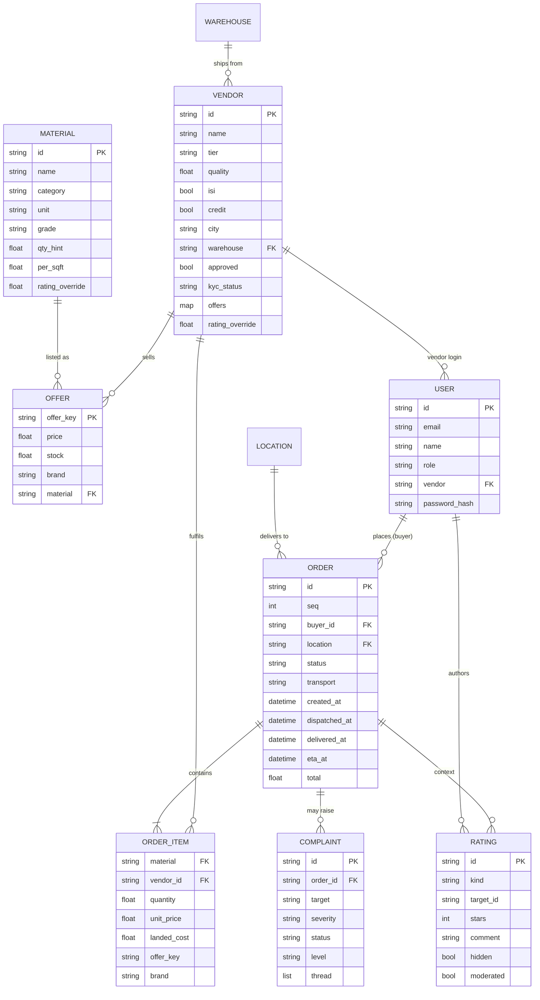
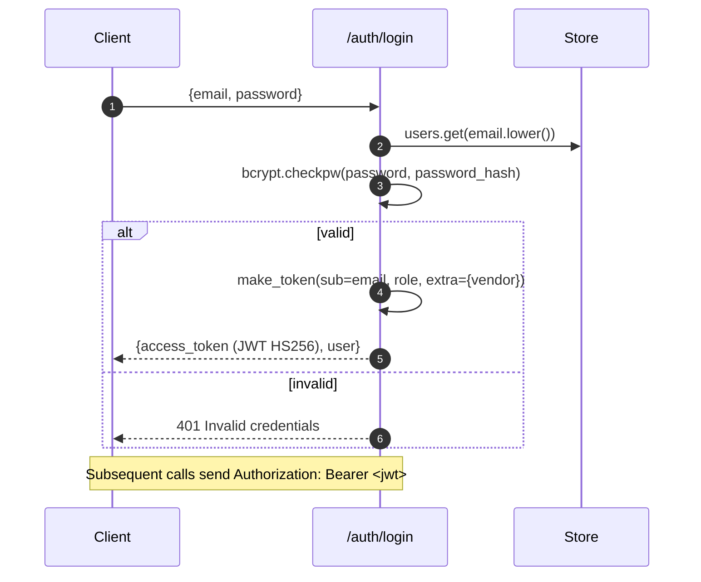
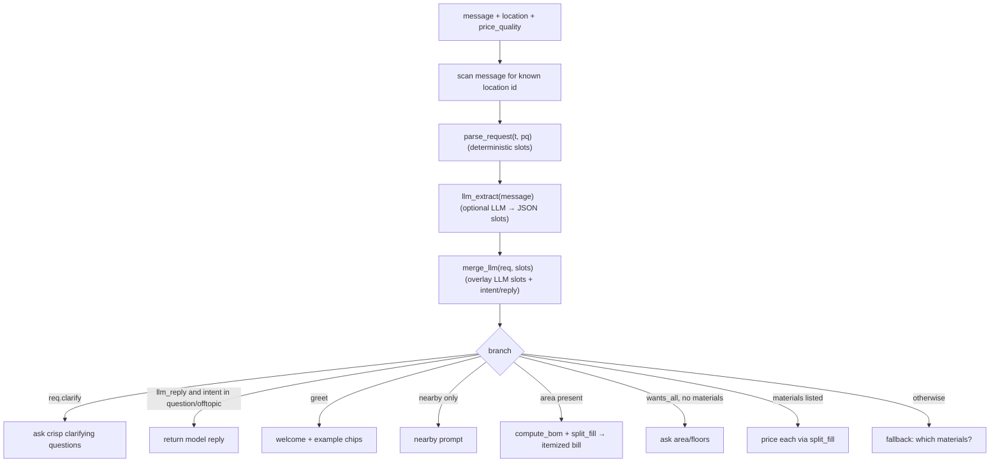
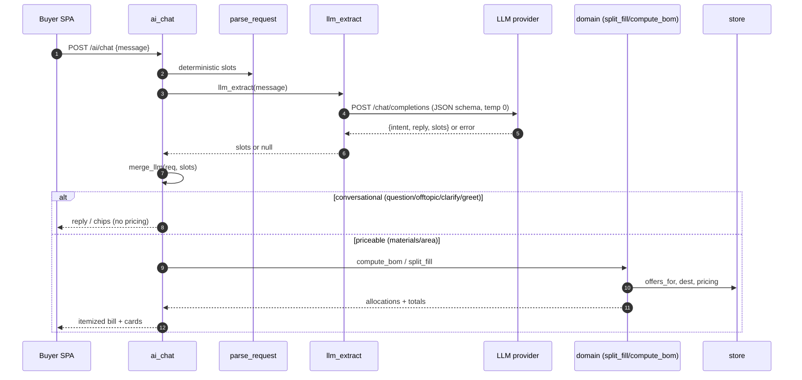
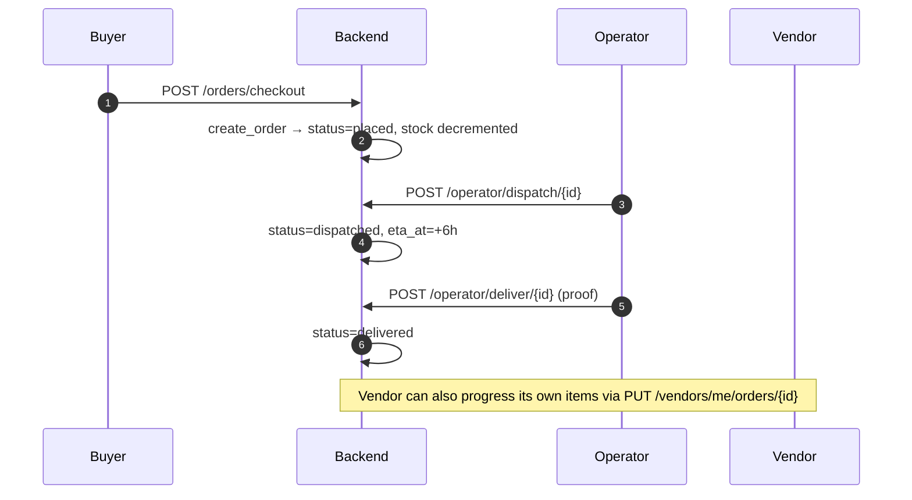

# Consmat AI — Low-Level Design (LLD)

> **Document status:** Baseline · **Version:** 1.0 · **API version:** `v1` · **Base path:** `/api/v1`

This document details the internal design of the Consmat AI backend and frontends: data models, the
full API surface, domain algorithms, the AI chat pipeline, authentication, frontend internals, and the
configuration reference. For the big picture see [HLD.md](./HLD.md); for deployment see [SLD.md](./SLD.md).

---

## Table of Contents
1. [Backend module structure](#1-backend-module-structure)
2. [Data model](#2-data-model)
3. [API reference](#3-api-reference)
4. [Authentication & authorization](#4-authentication--authorization)
5. [Store internals](#5-store-internals)
6. [Domain algorithms](#6-domain-algorithms)
7. [AI chat pipeline](#7-ai-chat-pipeline)
8. [Pricing determinism](#8-pricing-determinism)
9. [Order lifecycle & status vocabularies](#9-order-lifecycle--status-vocabularies)
10. [Frontend internals](#10-frontend-internals)
11. [Configuration reference](#11-configuration-reference)
12. [Error handling & fallback](#12-error-handling--fallback)

---

## 1. Backend Module Structure

Root: `backend/`. App package: `backend/app/`. The API prefix `/api/v1` comes from `config.yaml → app.api_prefix`.

| File | Responsibility |
|------|----------------|
| `app/main.py` | Creates `FastAPI(title="Consmat AI — Unified API", version="1.0.0")`, adds CORS, registers routers under `/api/v1`, exposes unprefixed `GET /health` and `GET /` |
| `app/config.py` | `@lru_cache cfg()` loads `config.yaml`; `pricing_cfg()`; `CONFIG_PATH` overridable via env; `JWT_SECRET` env override |
| `app/auth.py` | bcrypt hashing, JWT encode/decode, `current_user` / `optional_user` / `require_role` dependencies |
| `app/store.py` | In-memory `Store` class + module singleton `store = Store()`; seeding, orders/complaints/ratings logic, ratings math |
| `app/domain.py` | Pure math: `distance_km`, `logistics_cost`, `value_score`, `rank_vendors`, `cheapest`, `split_fill`, `compute_bom` |
| `app/serializers.py` | Per-app response shaping and status vocabularies (`ADMIN_STATUS`, `VENDOR_STATUS`, `OPERATOR_STATUS`) |
| `app/routers/common.py` | `/ai/status`, `/auth/*`, `/materials`, `/warehouses`, `/locations` |
| `app/routers/buyer.py` | `/match`, `/ai/chat` (AI pipeline), `/estimate`, `/optimize`, `/orders/*`, `/tracking/active` |
| `app/routers/vendor.py` | `/vendors/register`, `/vendors/me`, offer CRUD, vendor orders |
| `app/routers/admin.py` | metrics, orders, vendor KYC CRUD, staff, logistics config |
| `app/routers/operator.py` | dispatch queue, dispatch/deliver, network stock, reorder, saved views |
| `app/routers/support.py` | complaints lifecycle (create/list/message/escalate/status/metrics) |
| `app/routers/ratings.py` | ratings create/list, product ratings, moderation, overrides |

Router registration (`main.py`):

```python
for r in (common.router, buyer.router, vendor.router, admin.router,
          operator.router, support.router, ratings.router):
    app.include_router(r, prefix=PREFIX)   # PREFIX = "/api/v1"
```

Seeding is performed at **import time** by the module-level `store = Store()` (constructor calls
`reset()`), not via a FastAPI startup event.

---

## 2. Data Model

All entities live in the in-memory `Store`, seeded from `config.yaml`. There is no relational schema;
the diagram below shows logical relationships and key fields.



### 2.1 Entity field detail

- **Material** (`materials`, keyed by id): `id, name, category, unit, grade, qty_hint, per_sqft, image_url` (+ optional `rating_override`). `per_sqft` is the BOM coefficient (material per built-up sq ft).
- **Vendor** (`vendors`, keyed by id): `id, name, tier, category, quality, isi, credit, city, phone, gstin, warehouse, approved, offers, kyc_status, established, rating_count, description` (+ optional `rating_override`, `reject_reason`). `offers` is `{offer_key: {price, stock, brand?, material?, name?, category?, unit?, image_url?}}`.
- **Offer key** — a plain material id (`cement`) or a brand composite (`cement#acc`). `offer_material(key)` resolves it via `offer["material"]` or `key.split("#")[0]`.
- **User** (`users`, keyed by lowercase email): `id, email, name, role, vendor, location, password_hash`.
- **Order** (`orders`, list): `id="ORD-{seq}", seq, buyer_id, buyer_name, buyer_phone, buyer_email, buyer_gstin, location, address, payment_method, transport, status, priority, created_at, dispatched_at, delivered_at, eta_at, rating, proof, proof_type, note, items[], total`.
- **Order item**: `material, name, category, unit, vendor_id, vendor_name, warehouse_id, warehouse_name, quantity, unit_price, landed_cost, offer_key, brand`.
- **Complaint** (`complaints`, list): `id="CMP-{seq}", order_id, raised_by{role,name,email}, target, subject, description, severity, status, level, order_snapshot, thread[{by,role,at,note}], created_at, updated_at`.
- **Rating** (`ratings`, list): `id="RAT-{seq}", kind, target_id, target_name, stars, comment, by{role,name,email}, order_id, hidden, created_at` (+ `moderated`).
- **Warehouse**: `id, name, lat, lng, owner`. **Location**: `id, label, lat, lng`.
- **View** (saved dispatch filter): `id="vw_...", name, filter, search, sort, created_by`. **Reorder**: `reorder_id="RO-...", product_id, vendor_id, qty, at`.

Sequence counters: orders `_seq=1000` (`ORD-`), complaints `_cseq=5000` (`CMP-`), ratings `_rseq=7000` (`RAT-`).

---

## 3. API Reference

All paths are prefixed with **`/api/v1`**. Auth column: *none* = public, *user* = any authenticated
user, otherwise the required role(s). Bearer token via `Authorization: Bearer <jwt>`.

### 3.1 Common — `common.py`

| Method | Path | Auth | Description |
|--------|------|------|-------------|
| GET | `/ai/status` | none | LLM live/stub state → `{live, mode, engine, model, key_configured}` |
| POST | `/auth/login` | none | `{email,password}` → `{access_token, token_type, user{id,email,name,role,vendor_id}}` |
| GET | `/auth/me` | user | Current user profile |
| GET | `/materials` | none | Catalog with aggregate ratings |
| GET | `/warehouses` | none | All warehouses |
| GET | `/locations` | none | All delivery locations |

### 3.2 Buyer — `buyer.py`

| Method | Path | Auth | Description |
|--------|------|------|-------------|
| POST | `/match` | none | `{material, quantity?, location, price_quality}` → ranked vendor cards (incl. out-of-stock) |
| POST | `/ai/chat` | none | `{message, location, price_quality, history?}` → `{reply, chips, cards, suggestions}` |
| POST | `/estimate` | none | `{description?, area?, location}` → `{items[], total, note}` (BOM) |
| POST | `/optimize` | none | `{items[], location}` → split-vs-single comparison + savings |
| POST | `/orders/checkout` | optional | `{items[], payment_method, location, transport, optimize?}` → `{order_id, transport, total}` |
| GET | `/orders` | optional | Orders (buyers see own) |
| GET | `/orders/{id}/tracking` | optional | Synthetic route/progress/ETA |
| GET | `/tracking/active` | optional | All dispatched deliveries |

**Match card fields:** `vendor, vendor_id, material, quantity, unit, landed_price, material_cost,
logistics_cost, quality, warehouse, distance, why, price_per_unit, rank, in_stock, stock,
out_of_stock, brand, offer_key, credit, isi, tier`.

**`transport` values:** `inbuilt` (default), `external`, `self` (self-pickup drops logistics from landed cost).

### 3.3 Vendor — `vendor.py` (role `vendor` unless noted)

| Method | Path | Auth | Description |
|--------|------|------|-------------|
| POST | `/vendors/register` | none | Self-register (approved=false, KYC pending) → `{access_token, user}`; 409 if email exists |
| GET | `/vendors/me` | vendor | Vendor profile + offers |
| POST | `/vendors/me/offers` | vendor | Create offer; brand on known material → key `base#slug` |
| PUT | `/vendors/me/offers` | vendor | Update (merges into existing offer) |
| DELETE | `/vendors/me/offers/{id}` | vendor | Remove offer; 404 if absent |
| GET | `/vendors/me/orders` | vendor | Orders containing this vendor's items |
| PUT | `/vendors/me/orders/{id}` | vendor | `{status,note?}`; `accept→dispatched`, `fulfil/deliver→delivered`, `cancel/reject→cancelled` |

### 3.4 Admin — `admin.py` (role `admin` unless noted)

| Method | Path | Auth | Description |
|--------|------|------|-------------|
| GET | `/admin/metrics` | admin | `{gmv, orders, active_vendors, pending_kyc}` |
| GET | `/admin/orders` | admin | Orders in `[start,end]` |
| GET | `/admin/vendors` | admin | Vendor summaries |
| GET | `/admin/vendors/{id}` | admin | Vendor detail (reviews, docs, breakdown, history) |
| POST | `/admin/vendors/{id}/approve` | admin | Approve + KYC approved (quality 0 → 3.8) |
| POST | `/admin/vendors/{id}/reject` | admin | `{reason?}` → approved=false, KYC rejected |
| POST | `/admin/vendors/{id}/revoke` | admin | approved=false, KYC pending |
| POST | `/admin/vendors` | admin | Create vendor (`AddVendorBody`) |
| DELETE | `/admin/vendors/{id}` | admin | Remove vendor + tied logins |
| POST | `/admin/vendors/bulk-approve` | admin | `{ids[]}` → `{approved:n}` |
| GET | `/admin/staff` | admin, manager | Operators + managers |
| POST | `/admin/staff` | admin, manager | Add staff (managers may add only operators) |
| DELETE | `/admin/staff/{email}` | admin, manager | Remove staff (managers may remove only operators) |
| GET | `/admin/logistics-config` | admin | Current logistics config |
| PUT | `/admin/logistics-config` | admin | Update; syncs `rate_per_km`, `handling`, `quality_gate` into live pricing |

### 3.5 Operator — `operator.py` (roles `operator, manager, admin`)

| Method | Path | Description |
|--------|------|-------------|
| GET | `/operator/dispatch-queue` | Non-cancelled orders as tickets |
| POST | `/operator/dispatch/{id}` | Set dispatched; `eta_at = dispatched_at + 6h` |
| POST | `/operator/deliver/{id}` | `{proof?,proof_type?,note?}` → delivered + proof |
| GET | `/operator/network-stock` | Per-material approved-vendor stock |
| POST | `/operator/reorder` | `{product_id,vendor_id,qty?}` → adds stock, logs `RO-...` |
| GET/POST/DELETE | `/operator/views[/{id}]` | Saved dispatch filters |

### 3.6 Support / Complaints — `support.py`

Constants: `SEVERITIES = {low, medium, high, critical}`; `STAFF_ROLES = (operator, manager, admin)`;
`NEXT_LEVEL = {operator: manager, manager: admin}`.

| Method | Path | Auth | Description |
|--------|------|------|-------------|
| POST | `/support/complaints` | buyer, vendor | Create; order-based attaches snapshot; one open per order per person (409) |
| GET | `/support/complaints` | user | Staff see all; vendor sees own+involved; buyer sees own |
| GET | `/support/complaints/{id}` | user | Full view (guarded by `_can_see`) |
| POST | `/support/complaints/{id}/messages` | user | Append thread; staff on `open` → `in_progress` |
| POST | `/support/complaints/{id}/escalate` | operator, manager | Level must equal caller role; bumps via `NEXT_LEVEL` |
| POST | `/support/complaints/{id}/status` | staff | `{status}` ∈ `{in_progress, resolved, closed, open}` |
| GET | `/support/metrics` | staff | Totals by status/severity/level |

### 3.7 Ratings — `ratings.py`

`KINDS = (vendor, product, delivery, care)`; `MODERATORS = (admin, manager)`.

| Method | Path | Auth | Description |
|--------|------|------|-------------|
| POST | `/ratings` | buyer | `{kind, target_id, stars(1-5), comment?, order_id?}` |
| GET | `/ratings` | optional | `?kind&target_id` → summary + visible ratings |
| GET | `/products/ratings` | none | `{material_id: {average, count}}` |
| GET | `/moderation/ratings` | admin, manager | All ratings (`?kind`) |
| GET | `/moderation/ratings/overview` | admin, manager | Aggregates |
| PUT | `/moderation/ratings/{id}` | admin, manager | `{stars?, comment?, hidden?}` → `moderated=true` |
| PUT | `/moderation/vendors/{id}/rating-override` | admin, manager | Clamp 0–5, `null` clears |
| PUT | `/moderation/materials/{id}/rating-override` | admin, manager | Same for materials |

---

## 4. Authentication & Authorization



- **Hashing** — `hash_password` uses `bcrypt.hashpw(pw, gensalt())`; `verify_password` uses `bcrypt.checkpw` (False on error).
- **Token** — `make_token(sub, role, extra)` builds payload `{sub, role, iat, exp=now+ttl, **extra}` and signs with `jwt_secret` / `HS256`. `sub` is the user's **email**. TTL = `access_token_ttl_min` (1440 = 24h). Vendor tokens carry `vendor` (vendor_id).
- **Dependencies** — `bearer = HTTPBearer(auto_error=False)`; `current_user` (401 on missing/invalid/unknown), `optional_user` (returns `None`, never raises), `require_role(*roles)` (403 `"Requires role: ..."`).
- **Roles** — `buyer, vendor, operator, manager, admin`. Manager is a superset of operator plus escalation/moderation/staff powers.

---

## 5. Store Internals

`store = Store()` is a module singleton; mutations are guarded by `_LOCK = threading.RLock()`.
`reset()` re-seeds every collection from `cfg()`.

**Collections:** `warehouses`, `locations`, `materials`, `vendors`, `users` (dicts) and `orders`,
`views`, `reorders`, `complaints`, `ratings` (lists). Plus `pricing`, `logistics_config`,
`low_thresholds`, and a deterministic `rng = random.Random(42)`.

**Key methods:**

| Method | Purpose |
|--------|---------|
| `offer_material(key, off)` | Resolve a material id from an offer key (handles `cement#acc`) |
| `offers_for(material)` | All vendor offers for a material, enriched with vendor rating, warehouse, stock, brand, isi, credit, tier |
| `dest(location)` | Location dict (defaults to `hyderabad`) |
| `create_order(items, location, payment_method, buyer_id, buyer_name)` | Lock, **decrement stock on the exact offer/brand**, insert order at front |
| `get_order(oid)` | Match by `id` or `seq` |
| `vendor_rating(vid)` | override → buyer average → seed `quality` |
| `product_rating(mid)` | override → average → `None` |
| `rating_summary(kind, target_id)` | `{average, count, effective_count, breakdown}` |
| `order_snapshot(o)` | Frozen order context for complaints |

**Stock semantics:** stock is decremented only on `create_order` (checkout), incremented on `reorder`.
Dispatch/deliver do **not** change stock.

---

## 6. Domain Algorithms

All in `domain.py` — pure functions, no I/O. Pricing constants come from `config.yaml → pricing`
(`rate_per_km=38, handling=600, quality_gate=3.3`, `load_factor` per material).

### 6.1 Distance
```
distance_km(a, b) = round( 2·R·asin(√s) · 1.35 )     # R = 6371 km, 1.35 = road factor
```
Haversine great-circle distance inflated by a 1.35 road-network factor.

### 6.2 Logistics cost
```
logistics_cost(km, material, cfg) = km · rate_per_km · load_factor[material] + handling
```
`load_factor` = `{cement:1.0, steel:1.4, sand:1.6, aggregate:1.6, bricks:1.3}`; `handling=600` per delivery.

### 6.3 Value score (price–quality ranking)
```
w      = 0.03 + pq · 0.20
target = 3.5  + pq · 1.3
value_score(landed, quality, pq) = landed · (1 + w·(target − quality))
```
`pq` is normalized 0–1. Higher `pq` weights vendor quality more heavily, penalizing low-quality vendors
even when cheaper.

### 6.4 Ranking & cheapest
`rank_vendors(offers, quantity, dest, pq_pct, material, cfg, include_oos=False)`:
1. Skip un-approved vendors.
2. Skip out-of-stock unless `include_oos`.
3. Enforce `quality ≥ quality_gate` (3.3).
4. Compute `distance_km`, `logistics_cost`, `material_cost = unit_price·qty`, `landed_cost`, `value_score`, `in_stock`, `out_of_stock`.
5. Sort by `(out_of_stock, value_score)` and assign `rank`.

`cheapest(...)` = `rank_vendors(..., pq=35)` then `min` by `landed_cost`.

### 6.5 Split fill (stock-aware multi-vendor allocation)
`split_fill(offers, quantity, dest, material, cfg) → (allocations, shortfall)`:
1. `rank_vendors(..., pq=5)` (price-biased), re-sort by `(unit_price, −quality)`.
2. Greedily take `min(remaining, stock)` from each vendor until filled.
3. Cement rounds up to whole bags; other materials `round(qty, 2)`.
4. Add fixed logistics **per vendor** (each shipment is a separate delivery).
5. Return allocations `{vendor_id, vendor_name, quantity, unit_price, logistics, landed_price, distance_km, quality, warehouse_name, stock, brand, offer_key}` and any `shortfall`.

### 6.6 Bill of Materials
`compute_bom(area_per_floor, floors, multiplier, brick_walls, materials) → (total_area, lines)`:
```
total_area = area_per_floor · floors
quantity_m = total_area · per_sqft[m] · multiplier      # cement: ceil; others: max(1.0, round(q,1))
```
Bricks are skipped when `brick_walls` is false. `multiplier` = construction-type factor
(economy 0.9, standard 1.0, premium 1.18).

---

## 7. AI Chat Pipeline

The `POST /ai/chat` endpoint combines a deterministic parser with an optional LLM understanding layer.
**Prices always come from the domain engine** ([§8](#8-pricing-determinism)).



### 7.1 Deterministic parser — `parse_request(t, default_pq)`
Returns a `req` dict: `{materials, qty, area, floors, brick_walls, wants_all, greet, nearby,
construction_type, mult, pq, floors_list?, enumerated?, parking_no_area?, clarify?, llm_intent?,
llm_reply?}`. Detects materials via keyword regex, quantities via qty+unit+material regex, price bias
from cheap(5)/quality(90) keywords, floors via `\d+ floors` / `g+\d`, construction type via keywords.

- `_parse_area(t)` — sums built-up area clause-by-clause (splits on `,;.`/"and"), strips `NbhK` leading digits, honors "each", ignores areas < 80.
- `_parse_floor_areas(t)` — detects **explicitly labelled** per-floor areas (ground/first/basement/parking). When present, the **sum is the total** and is never re-multiplied by floor count (this fixes the villa double-count).

### 7.2 LLM understanding — `llm_extract(message)`
Optional. Reads env `AI_PROVIDER`, `AI_API_KEY`, `AI_MODEL`, `AI_BASE_URL`. Returns parsed JSON slots
or `None` on any error (→ fallback to deterministic parser).

**Provider resolution** (`OPENAI_COMPAT` map — base URL + default model):

| Provider | Base URL | Default model |
|----------|----------|---------------|
| `openai` | `https://api.openai.com/v1` | `gpt-4o-mini` |
| `gemini` | `https://generativelanguage.googleapis.com/v1beta/openai` | `gemini-2.0-flash` |
| `groq` | `https://api.groq.com/openai/v1` | `llama-3.3-70b-versatile` |
| `openrouter` | `https://openrouter.ai/api/v1` | `meta-llama/llama-3.3-70b-instruct` |
| `openai-compat` | *(from `AI_BASE_URL`)* | *(from `AI_MODEL`)* — e.g. local Ollama |
| `anthropic` | `https://api.anthropic.com/v1/messages` | `claude-3-5-haiku-latest` |

Transport is Python stdlib `urllib` (`_post_json`, 30s timeout). OpenAI-compatible providers use
`temperature=0` + `response_format={"type":"json_object"}`. The system prompt is a strict-JSON schema
that **forbids inventing prices/stock/vendors** and requests these keys:

`intent, reply, materials, floor_areas, area, floors, parking, construction_type, brick_walls,
location, price_pref, brand, per_floor_breakdown, wants_all, ready, clarify`.

- `intent ∈ {order, estimate, question, offtopic, greeting}` — drives conversational routing.
- `reply` — model-authored message for question/offtopic/greeting turns.
- `clarify` — questions to ask when `ready=false`.

### 7.3 Merge — `merge_llm(req, slots)`
Overlays LLM slots onto the deterministic `req`: materials/quantities, per-floor areas (sets
`enumerated`), area/floors, parking, construction_type→multiplier, brick_walls, wants_all,
`price_pref`→pq, and captures `llm_intent` + `llm_reply`. `clarify` is applied only when `ready=false`.

### 7.4 Response routing (`ai_chat` branch order)
1. `req.clarify` → ask clarifying questions (chips).
2. LLM non-purchase turn (`llm_reply` and `intent ∈ {question, offtopic}`, or nothing concrete to price and not a greeting) → return the model's reply.
3. `greet` → welcome + example chips.
4. `nearby` with nothing else → nearby prompt.
5. `area` present → full BOM (enumerated per-floor vs area×floors) via `compute_bom` + `_build_lines`.
6. `wants_all` without materials → ask for area/floors.
7. Materials listed (or all five) → price each via `split_fill`.
8. Fallback → "which materials do you need?".

### 7.5 End-to-end sequence



---

## 8. Pricing Determinism

The system guarantees that **no monetary figure originates from the LLM**:

- The LLM schema explicitly forbids prices/stock/vendors and is asked for structure only.
- On any LLM error/timeout/quota, `llm_extract` returns `None` and the deterministic parser drives the turn.
- Every quantity and price is produced by `domain.compute_bom`, `domain.rank_vendors`,
  `domain.split_fill`, and `domain.cheapest`, reading only `store` data seeded from `config.yaml`.
- Result: pricing is reproducible and auditable from config + store, independent of the AI layer.

---

## 9. Order Lifecycle & Status Vocabularies

Internal statuses (stored on the order): `placed | dispatched | delivered | cancelled`. Each app maps
these to its own vocabulary via `serializers.py` (`ADMIN_STATUS`, `VENDOR_STATUS`, `OPERATOR_STATUS`).



Tracking (`/orders/{id}/tracking`) synthesizes origin/dest/vehicle coordinates, `progress`,
`distance_km`, `remaining_km`, driver, and ETA from the order's timestamps and locations.

---

## 10. Frontend Internals

All four SPAs share the same tooling: **React 19 + CRACO (CRA) + Tailwind + shadcn/ui (Radix)**,
`react-router-dom` 7, axios, sonner toasts, and `@`-alias imports (`@ → src`). Auth token in
`localStorage`, injected via an axios request interceptor as `Authorization: Bearer`.

| App | Port | Router entry | Key screens | Server state | Polling |
|-----|------|--------------|-------------|--------------|---------|
| **Buyer** | 8084 | `App.js` → `Home.jsx` | Shop / Chat / Estimate modes, Cart, Checkout (optimize), Orders + LiveTracking, Support, Rate | React Context (`AppContext`) | orders 8s |
| **Vendor** | 8081 | `App.js` → `Dashboard.jsx` | Register, Profile, InventoryTable (offer CRUD), OrdersList, sales charts | React Query (`vendor-me`, `vendor-orders`) | orders 30s |
| **Admin** | 8082 | `App.js` → `AdminLayout` | Overview, Vendors (KYC), Orders, Support, Ratings, Logistics | React Query (inline) | on demand |
| **Operator** | 8083 | `App.js` → `Operator.jsx` | Dispatch Queue, Live Fleet, Support, Network Stock, (mgr+) Ratings | local + `/operator/views` | queue 10–60s |

**API layer** — each app has `src/lib/api.js` (axios) targeting the `/api/v1` prefix:
- **Buyer** — `BASE = REACT_APP_API_BASE_URL || REACT_APP_BACKEND_URL || ""`; token keys `consmat_token`/`consmat_user`; 401 → clear + redirect.
- **Vendor** — base is **runtime-overridable** via `localStorage.vendor_api_base` (`ApiConfigDialog.jsx`); token keys `vendor_token`/`vendor_user`.
- **Admin / Operator** — `BASE = ${REACT_APP_BACKEND_URL}/api/v1`; bearer interceptor; operator also 401-redirects.

> ⚠️ **Design note:** buyer/vendor tolerate an empty base (works behind the nginx same-origin proxy),
> but admin/dispatch hard-compose `${REACT_APP_BACKEND_URL}/api/v1`, so those two require the env at
> build time (otherwise base becomes `undefined/api/v1`). Recommend unifying on the empty-base +
> nginx-proxy convention.

**Role-based UI** — chiefly `Operator.jsx`, which appends a **Ratings** moderation tab only for
`role ∈ {manager, admin}`. Otherwise each app *is* a persona, and the backend enforces role guards.

**Design system** — dark UI (`bg #0f1216`, panel `#171c22`, accent orange `#ff7a2f`), 46-file
shadcn/ui set per app, `cn()` (clsx + tailwind-merge), lucide-react icons (+ phosphor in dispatch),
sonner toasts, order-event chimes (buyer/vendor).

---

## 11. Configuration Reference

`backend/config.yaml` is the single source of catalog, pricing, logistics, and seed data.

### 11.1 App & security
`app.name`, `app.api_prefix=/api/v1`, `app.jwt_secret` (env `JWT_SECRET` overrides), `app.jwt_alg=HS256`,
`app.access_token_ttl_min=1440`, `app.seed_orders=14`, `app.random_seed=42`.

### 11.2 Pricing
`pricing.rate_per_km=38`, `pricing.handling=600`, `pricing.quality_gate=3.3`,
`pricing.load_factor = {cement:1.0, steel:1.4, sand:1.6, aggregate:1.6, bricks:1.3}`.

### 11.3 Logistics config (admin-editable)
`rate_per_km=38, handling_fee=600, quality_gate=3.3, min_order_value=5000,
free_delivery_threshold=50000, cod_enabled=true, express_dispatch=false,
default_dispatch_hub=hub, max_delivery_radius_km=120`.

### 11.4 Materials & BOM coefficients
| id | name | unit | grade | qty_hint | `per_sqft` |
|----|------|------|-------|----------|-----------|
| cement | Cement | bags | OPC 53-Grade | 50 | 0.40 |
| steel | TMT Steel | tonnes | Fe 500D | 2 | 0.004 |
| sand | River Sand | tonnes | Fine (plastering) | 10 | 0.0816 |
| aggregate | Aggregate 20mm | tonnes | 20mm blue metal | 10 | 0.057 |
| bricks | Bricks | pcs | Class-A red clay | 500 | 8.0 |

Construction-type multipliers (in code): economy 0.9, standard 1.0, premium 1.18.

### 11.5 Warehouses, locations, vendors
- **Warehouses (5):** hub, ibrahim, medchal, sangareddy, bhongir — `{id,name,lat,lng,owner}`.
- **Locations (6):** ibrahimpatnam, medchal, sangareddy, bhongir, ghatkesar, hyderabad — `{id,label,lat,lng}`.
- **Vendors (8):** e.g. `v_deccan` (q4.6, multi-brand cement + steel), `v_ultrabuild` (q4.8, cement OOS, steel, bricks), `v_localbuild` (q2.9 — **below quality gate**, filtered out), `v_newcement` (**approved=false**, pending KYC). Offers use brand composite keys (`cement#acc`).

### 11.6 Ops toggles & demo users
- `payments.provider=mock, enabled=false` (mock|razorpay|stripe|payu|cashfree).
- `logistics_engine.provider=haversine` (haversine|osrm), `osrm_url_env=OSRM_URL`.
- `notifications.provider=none` (none|gupshup|msg91|twilio).
- `persistence.mode=memory` (memory|postgres), `database_url_env=DATABASE_URL`.
- **Demo users** (password `consmat123`): `buyer@consmat.com` (buyer), `vendor@consmat.com` (vendor→v_ultrabuild), `admin@consmat.com` (admin), `operator@consmat.in` (operator), `manager@consmat.com` (manager).

---

## 12. Error Handling & Fallback

- **LLM failures** — `llm_extract` wraps the HTTP call in try/except; any error (404 model-retired,
  429 quota, timeout, JSON parse) returns `None`, and the deterministic parser handles the turn. Errors
  are logged as `[llm_extract] ERROR ...` (with the provider's response body) for diagnosis.
- **Auth failures** — `current_user` raises 401; role guards raise 403 `"Requires role: ..."`.
- **Not found** — order/vendor/offer/complaint lookups return explicit `{error: ...}` or HTTP 404.
- **Business rules** — duplicate open complaint per order → 409; duplicate vendor email → 409;
  managers restricted to operator-only staff actions → 400/403.
- **Store consistency** — all mutations run under `_LOCK` (RLock).

---

*Related: [HLD.md](./HLD.md) · [SLD.md](./SLD.md)*
