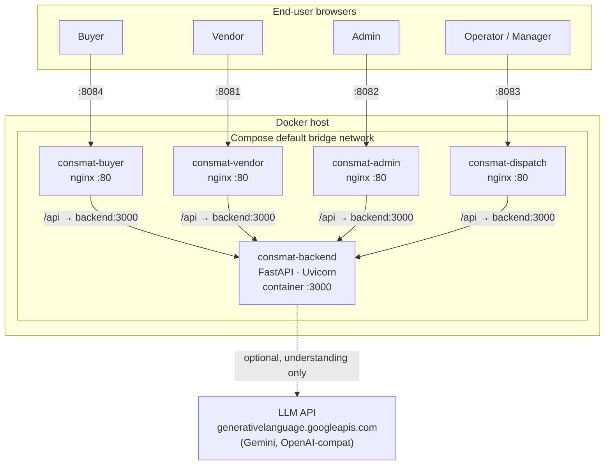
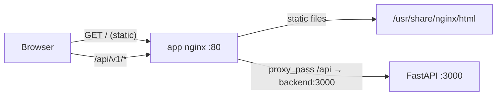
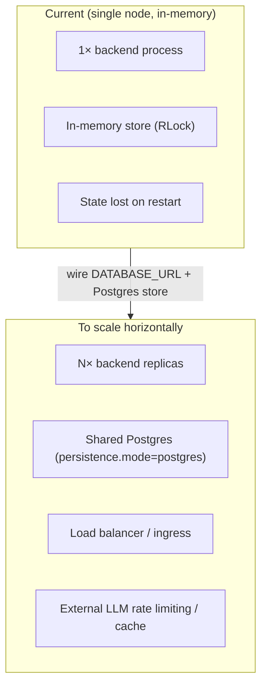

# Consmat AI — System-Level Design (SLD)

> **Document status:** Baseline · **Version:** 1.0 · **Orchestration:** Docker Compose (v2)

This document describes the deployment landscape of Consmat AI: containers, networking, environment
configuration, external integrations, runtime characteristics, and operational concerns. For
architecture see [HLD.md](./HLD.md); for internals see [LLD.md](./LLD.md).

---

## Table of Contents
1. [Scope & context](#1-scope--context)
2. [Deployment landscape](#2-deployment-landscape)
3. [Container / service inventory](#3-container--service-inventory)
4. [Images & Dockerfiles](#4-images--dockerfiles)
5. [Networking & request routing](#5-networking--request-routing)
6. [Environment configuration](#6-environment-configuration)
7. [External integrations](#7-external-integrations)
8. [Runtime characteristics](#8-runtime-characteristics)
9. [Build & run procedures](#9-build--run-procedures)
10. [Scaling considerations & limitations](#10-scaling-considerations--limitations)
11. [Security considerations](#11-security-considerations)
12. [Observability & operations](#12-observability--operations)

---

## 1. Scope & Context

Consmat AI runs as **five Docker containers** orchestrated by a single `docker-compose.yml` at the repo
root: one FastAPI backend and four nginx-served React SPAs. All containers share the Compose default
bridge network and are exposed to the host on distinct ports. The system is self-contained — the only
*optional* external dependency is an LLM API (Gemini/OpenAI-compatible) for the AI assistant's
understanding layer.

- **Repo:** `github.com/Tadipartirohith/consmat-ai-GA-APP.git`
- **Orchestration:** `docker-compose.yml` (Compose v2 syntax; no top-level `version:` key)
- **Networks/volumes:** none declared — implicit Compose default bridge; no named volumes (in-memory state)

---

## 2. Deployment Landscape



Host port mapping (from repo-root `.env`): buyer **8084**, vendor **8081**, admin **8082**, dispatch
**8083**, backend **3000**. (Compose defaults would put buyer on 8080; it was moved to 8084 locally
because port 8080 is taken.)

---

## 3. Container / Service Inventory

Every service uses `restart: unless-stopped`. Images are built locally from their contexts (no `image:`
names declared → Compose names them `<project>-<service>`, e.g. `consmatai-repo-backend`).

| Service | container_name | Build context | Host→Container | depends_on | Env vars |
|---------|----------------|---------------|----------------|------------|----------|
| `backend` | `consmat-backend` | `./backend` | `${BACKEND_PORT:-3000}:3000` | — | `JWT_SECRET, AI_PROVIDER, AI_API_KEY, AI_MODEL, AI_BASE_URL` |
| `buyer` | `consmat-buyer` | `./frontends/buyer` | `${BUYER_PORT:-8080}:80` | `backend` | — |
| `vendor` | `consmat-vendor` | `./frontends/vendor` | `${VENDOR_PORT:-8081}:80` | `backend` | — |
| `admin` | `consmat-admin` | `./frontends/admin` | `${ADMIN_PORT:-8082}:80` | `backend` | — |
| `dispatch` | `consmat-dispatch` | `./frontends/dispatch` | `${DISPATCH_PORT:-8083}:80` | `backend` | — |

Notes:
- `depends_on` is start-order only (no `condition: service_healthy`).
- Backend env uses `.env`-driven defaults: `JWT_SECRET:${JWT_SECRET:-change-me-in-prod}`,
  `AI_PROVIDER:${AI_PROVIDER:-stub}`, `AI_API_KEY:${AI_API_KEY:-}`, `AI_MODEL:${AI_MODEL:-}`,
  `AI_BASE_URL:${AI_BASE_URL:-}`.
- The backend healthcheck is defined in its **Dockerfile**, not in compose. Frontends have none.

---

## 4. Images & Dockerfiles

### 4.1 Backend — `backend/Dockerfile` (single-stage)
- Base **`python:3.11-slim`**; `ENV PYTHONUNBUFFERED=1 PYTHONDONTWRITEBYTECODE=1`.
- Installs `curl` (for healthcheck), then `pip install -r requirements.txt`, then copies source.
- `EXPOSE 3000`.
- `HEALTHCHECK --interval=15s --timeout=3s --retries=10 CMD curl -fsS http://localhost:3000/health || exit 1`.
- `CMD ["uvicorn", "app.main:app", "--host", "0.0.0.0", "--port", "3000"]`.

**Python dependencies** (`backend/requirements.txt`, pinned):
`fastapi==0.115.5`, `uvicorn[standard]==0.32.1`, `pydantic==2.10.3`, `PyYAML==6.0.2`,
`PyJWT==2.10.1`, `bcrypt==4.2.1`.

> **No `httpx`, `requests`, or vendor SDKs.** LLM HTTP calls use the Python stdlib `urllib.request`
> (`_post_json` in `buyer.py`). This is deliberate — it keeps the image minimal and avoids a dependency
> that was historically absent (its absence once silently disabled the LLM; see project history).

### 4.2 Frontends — `frontends/<app>/Dockerfile` (multi-stage, all four identical)
- **Stage 1 (build)** — `node:20-alpine`: copy `frontend/package.json` + lockfile,
  `npm install --no-audit --no-fund --legacy-peer-deps`, copy source, `CI=false npm run build` (CRA/CRACO → `/app/build`).
- **Stage 2 (serve)** — `nginx:1.27-alpine`: copy `nginx.conf` → `/etc/nginx/conf.d/default.conf`,
  copy `--from=build /app/build` → `/usr/share/nginx/html`, `EXPOSE 80` (stock nginx entrypoint).

A shared `frontends/Dockerfile.frontend` + `frontends/nginx.conf` template mirror the per-app copies.

---

## 5. Networking & Request Routing

- **Single backend, four SPAs.** One FastAPI process serves all app API shapes under `/api/v1`.
- **nginx → backend.** Each app's `nginx.conf` proxies `location /api/ → http://backend:3000`, resolving
  the Compose service name `backend` on the internal bridge network (HTTP/1.1, forwards
  `Host`/`X-Forwarded-For`/`X-Forwarded-Proto`, `proxy_read_timeout 60s`). `location / ` does SPA
  fallback `try_files $uri $uri/ /index.html`.
- **Same-origin.** Because the SPA and its API are served from the same nginx origin, browsers need no
  CORS for local runs.
- **No reverse-proxy container.** Each nginx both serves static files and proxies `/api`.
- **CORS** (backend `main.py`) is still applied from `config.yaml → deployment.allowed_origins`
  (default `["*"]`), `allow_methods=["*"]`, `allow_headers=["*"]`, `allow_credentials=False`.
- **Direct backend access:** `http://localhost:3000` (used by tooling, `/docs`, `/health`, `/ai/status`).



---

## 6. Environment Configuration

Two files: `.env` (real, **gitignored**) and `.env.example` (committed template). Secret **values are
redacted** here — only names and purpose are documented.

| Variable | Purpose | Default (`.env.example`) |
|----------|---------|--------------------------|
| `BACKEND_PORT` | Host port for FastAPI backend | `3000` |
| `BUYER_PORT` | Host port for buyer SPA | `8080` *(local `.env` uses 8084)* |
| `VENDOR_PORT` | Host port for vendor SPA | `8081` |
| `ADMIN_PORT` | Host port for admin SPA | `8082` |
| `DISPATCH_PORT` | Host port for operator/dispatch SPA | `8083` |
| `JWT_SECRET` | Backend JWT signing secret | `change-me-in-prod` |
| `AI_PROVIDER` | LLM provider selector: `stub`\|`gemini`\|`openai`\|`groq`\|`openrouter`\|`anthropic`\|`openai-compat` | `stub` |
| `AI_API_KEY` | LLM API key (blank in stub mode) | *(empty)* |
| `AI_MODEL` | Model id override | *(empty → provider default)* |
| `AI_BASE_URL` | Base URL, only for `openai-compat` (e.g. local Ollama) | *(empty)* |
| `PAYMENT_KEY_ID` / `PAYMENT_KEY_SECRET` / `PAYMENT_WEBHOOK_SECRET` | Payment gateway creds (stub when blank) | *(empty)* |
| `OSRM_URL` | OSRM routing server URL (optional logistics) | *(empty)* |
| `NOTIFY_API_KEY` | WhatsApp/SMS notifications key (optional) | *(empty)* |
| `DATABASE_URL` | Postgres DSN, only when `persistence.mode=postgres` | *(empty)* |

**Current active posture** (local `.env`): `AI_PROVIDER=gemini`, `AI_MODEL=gemini-flash-lite-latest`,
`AI_API_KEY=<Gemini key>` → live LLM understanding. All payment/OSRM/notify/DB knobs blank → stubbed.

> **.env hygiene:** `.gitignore` excludes `.env`, so secrets are not tracked. Keep real keys only in the
> untracked `.env`; never commit them. See [§11](#11-security-considerations).

---

## 7. External Integrations

Runtime switches live in `config.yaml`; secrets in `.env`. The backend reads env directly via
`os.environ.get(...)`.

| Integration | Config | Status | Notes |
|-------------|--------|--------|-------|
| **LLM provider** | `.env` `AI_*` | **Active (Gemini)** | Understanding only; prices always from tools. Provider table in [LLD §7.2](./LLD.md#72-llm-understanding--llm_extractmessage). Falls back to deterministic parser on any error/quota. |
| **Payment gateway** | `config.yaml payments` (`provider:mock, enabled:false`) | **Stubbed** | Adapters: mock/razorpay/stripe/payu/cashfree; checkout records the order without charging |
| **OSRM logistics** | `config.yaml logistics_engine` (`provider:haversine`) | **Optional/off** | Default uses Haversine × 1.35 road factor; set `OSRM_URL` + `provider:osrm` to enable |
| **Notifications** | `config.yaml notifications` (`provider:none`) | **Off** | Adapters: gupshup/msg91/twilio via `NOTIFY_API_KEY` |
| **Postgres persistence** | `config.yaml persistence` (`mode:memory`) | **In-memory active; Postgres off** | Store resets on restart; `DATABASE_URL` + `mode:postgres` reserved for durable state |

### 7.1 LLM free-tier quota note
Gemini free tier enforces **per-model daily request quotas**. Flagship models (e.g. what
`gemini-flash-latest` currently aliases to) have small daily caps; **lite** models
(`gemini-flash-lite-latest`) have a far more generous allowance and are ideal for the short
JSON-extraction prompts used here. On quota exhaustion (`HTTP 429`) the assistant degrades gracefully to
the deterministic parser — no downtime.

---

## 8. Runtime Characteristics

| Aspect | Behavior |
|--------|----------|
| **State** | In-memory `Store`, seeded from `config.yaml` at process start; **resets on backend restart** |
| **Concurrency** | Single Uvicorn process; store mutations serialized by `threading.RLock` |
| **Determinism** | `random.Random(42)` seed → reproducible seeded orders/ratings |
| **Healthcheck** | Backend `GET /health` every 15s (Dockerfile); 10 retries before unhealthy |
| **Restart policy** | `unless-stopped` on all five services |
| **Config reload** | Env/`.env` changes require `docker compose up -d --build backend` (image rebuild) or recreate |
| **Startup order** | Frontends `depends_on: backend` (start order only) |

---

## 9. Build & Run Procedures

**First run / full stack:**
```bash
docker compose up -d --build
```

**Rebuild only the backend** (after code or `.env` changes):
```bash
docker compose up -d --build backend
```

**Check status / health / AI mode:**
```bash
docker compose ps
curl http://localhost:3000/health
curl http://localhost:3000/api/v1/ai/status
```

**Access the apps** (from local `.env`): buyer `http://localhost:8084`, vendor `:8081`,
admin `:8082`, operator/dispatch `:8083`, backend/docs `http://localhost:3000/docs`.

**Demo logins** (password `consmat123`): `buyer@consmat.com`, `vendor@consmat.com`,
`admin@consmat.com`, `operator@consmat.in`, `manager@consmat.com`.

Convenience wrappers exist at the repo root: `START-HERE.bat` / `STOP.bat` (Windows),
`start.sh` / `stop.sh` (Unix).

---

## 10. Scaling Considerations & Limitations



- **Single point of state.** The in-memory store cannot be shared across replicas. Horizontal scaling
  requires implementing the reserved Postgres persistence mode so replicas share durable state.
- **Single Uvicorn process.** Vertical scaling only until persistence is externalized; then run multiple
  workers/replicas behind a load balancer.
- **Ephemeral data.** Orders, complaints, ratings, and stock changes reset on backend restart — fine for
  demo, not for production.
- **LLM quotas.** Free-tier daily caps bound conversational throughput; add caching/rate limiting and/or
  a paid tier for scale.
- **Frontend API-base inconsistency.** Admin/dispatch require `REACT_APP_BACKEND_URL` at build time,
  unlike buyer/vendor's empty-base + nginx-proxy design; unify before multi-environment deploys.

---

## 11. Security Considerations

| Area | Current state | Recommendation |
|------|---------------|----------------|
| **JWT secret** | `JWT_SECRET` env (default `change-me-in-prod`) | Set a strong secret per environment; never ship the default |
| **Password storage** | bcrypt hashes (no plaintext) | Adequate; enforce password policy on real signups |
| **API keys** | In untracked `.env`; `.gitignore` excludes `.env` | Keep keys only in `.env`; rotate any key ever exposed; consider a secrets manager |
| **CORS** | `allowed_origins: ["*"]` (local) | Lock to known origins in production via `config.yaml deployment.allowed_origins` |
| **Transport** | Plain HTTP locally | Terminate TLS at an ingress/reverse proxy in production |
| **AuthZ** | Role guards on privileged routes | Keep; audit new endpoints for correct `require_role` |
| **Payment** | Stubbed | Wire real gateway with server-side verification + webhook signature checks before taking payments |

> **Operational note:** the working-tree `.env` currently holds a live Gemini API key in plaintext.
> Because `.env` is gitignored it should not be committed, but the key exists on disk and (per project
> history) was exposed in chat — **rotate it** at the provider and replace the value in `.env`.

---

## 12. Observability & Operations

- **Health:** `GET /health` → `{status:"ok", service:...}` (drives the Docker healthcheck).
- **Root:** `GET /` → `{service, docs:"/docs", api_prefix:"/api/v1"}`.
- **AI status:** `GET /api/v1/ai/status` → `{live, mode, engine, model, key_configured}` — quick check
  of whether the LLM is live or on the stub.
- **API docs:** FastAPI Swagger UI at `/docs`.
- **Logs:** `logging.basicConfig(level=INFO)`; LLM errors logged as `[llm_extract] ERROR ...` with the
  provider's response body. View with `docker compose logs -f backend`.
- **Common operational checks:**
  ```bash
  docker compose logs --tail=50 backend            # recent backend logs
  docker compose logs backend | grep llm_extract   # LLM errors (quota, model, timeout)
  docker compose restart backend                   # bounce backend (state resets)
  ```

---

*Related: [HLD.md](./HLD.md) · [LLD.md](./LLD.md)*
